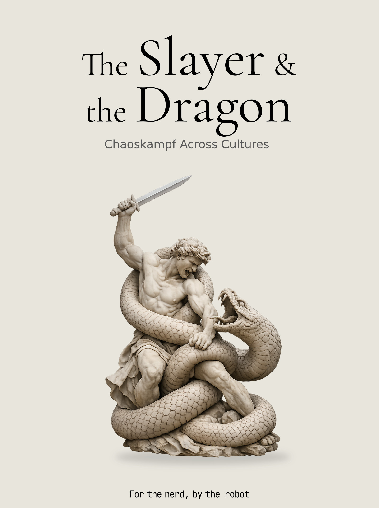

= The Slayer and the Dragon: Chaoskampf Across Cultures
Jose Blanca
:doctype: book
:toc: left
:sectnums:
:front-cover-image: 
:bibtex-file: bibliography.bib
:bibtex-style: chicago-author-date

include::chapters/00-introduction.edited.adoc[]

include::chapters/01-ninurta-asag.edited.adoc[]

include::chapters/02-ninurta-anzu.edited.adoc[]

include::chapters/03-marduk-tiamat.edited.adoc[]

include::chapters/04-mesopotamian-minor.edited.adoc[]

include::chapters/05-kumarbi-ullikummi.edited.adoc[]

include::chapters/06-illuyanka.edited.adoc[]

include::chapters/07-baal-yamm-lotan.edited.adoc[]

include::chapters/08-yahweh-leviathan-rahab.edited.adoc[]

include::chapters/09-revelation-red-dragon.edited.adoc[]

include::chapters/10-christian-reception.edited.adoc[]

include::chapters/11-zeus-typhon.edited.adoc[]

include::chapters/12-greek-dragons-after-typhon.edited.adoc[]

include::chapters/13-thraetaona-azidahaka.edited.adoc[]

include::chapters/14-indra-vrtra.edited.adoc[]

include::chapters/15-vedic-reflexes.edited.adoc[]

include::chapters/16-ra-apep.edited.adoc[]

include::chapters/17-horus-seth.edited.adoc[]

include::chapters/18-thor-jormungandr.edited.adoc[]

include::chapters/19-ie-reflexes.edited.adoc[]

include::chapters/20-slavic-baltic.edited.adoc[]

include::chapters/21-gonggong.edited.adoc[]

include::chapters/22-hou-yi.edited.adoc[]

include::chapters/23-susanoo-orochi.edited.adoc[]

include::chapters/24-huitzilopochtli-coatepec.edited.adoc[]

include::chapters/25-mesoamerican-cluster.edited.adoc[]

include::chapters/26-pariacaca-amaru.edited.adoc[]

include::chapters/27-mapuche-kai-tren.edited.adoc[]

include::chapters/28-bida-wagadu.edited.adoc[]

include::chapters/29-mwindo-kirimu.edited.adoc[]

include::chapters/30-bakunawa.edited.adoc[]

include::chapters/31-vainamoinen-iku-turso.edited.adoc[]

include::chapters/32-nanabozho-mishipeshu.edited.adoc[]

include::chapters/33-methods.edited.adoc[]

include::chapters/34-C1-combat-as-cosmogony.edited.adoc[]

include::chapters/35-C2-combat-as-sovereignty.edited.adoc[]

include::chapters/36-C3-cyclical-maintenance.edited.adoc[]

include::chapters/37-C4-eschatological-displacement.edited.adoc[]

include::chapters/38-C5-ie-hero-slay-serpent-formula.edited.adoc[]

include::chapters/39-C6-near-eastern-mediterranean-transmission.edited.adoc[]

include::chapters/40-C7-inversion-problem.edited.adoc[]

include::chapters/41-C8-refusal-and-appropriation.edited.adoc[]

include::chapters/42-reception-coda.edited.adoc[]

include::character-appendix.adoc[]
