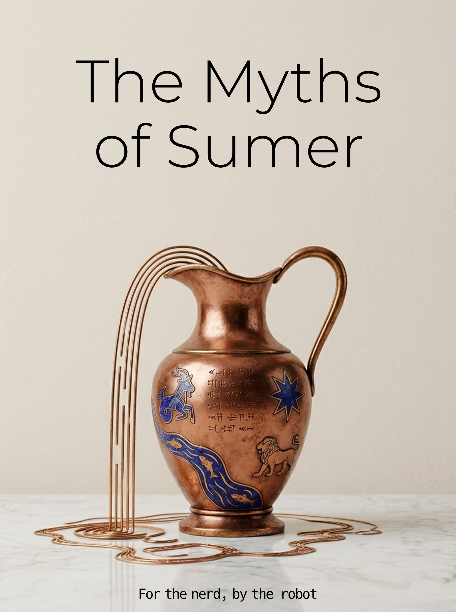

= The Myths of Sumer: Stories from the First Scribes
Jose Blanca
:doctype: book
:toc: left
:sectnums:
:front-cover-image: 
:bibtex-file: bibliography.bib
:bibtex-style: chicago-author-date

include::frontmatter.adoc[]

include::note-on-making.adoc[]

include::chapters/00-introduction.edited.adoc[]

include::chapters/01-enki-and-ninhursaja.edited.adoc[]

include::chapters/02-enki-and-ninmah.edited.adoc[]

include::chapters/03-enki-and-the-world-order.edited.adoc[]

include::chapters/04-enkis-journey-to-nibru.edited.adoc[]

include::chapters/05-enlil-and-ninlil.edited.adoc[]

include::chapters/06-enlil-and-sud.edited.adoc[]

include::chapters/07-lugal-e.edited.adoc[]

include::chapters/08-angim.edited.adoc[]

include::chapters/09-ninurta-and-the-turtle.edited.adoc[]

include::chapters/10-inanna-and-enki.edited.adoc[]

include::chapters/11-inanna-and-ebih.edited.adoc[]

include::chapters/12-inanna-and-shu-kale-tuda.edited.adoc[]

include::chapters/13-inanna-and-gudam.edited.adoc[]

include::chapters/14-inannas-descent.edited.adoc[]

include::chapters/15-dumuzids-dream.edited.adoc[]

include::chapters/16-inanna-and-bilulu.edited.adoc[]

include::chapters/17-nannas-journey-to-nibru.edited.adoc[]

include::chapters/18-marriage-of-martu.edited.adoc[]

include::chapters/19-gilgamesh-and-aga.edited.adoc[]

include::chapters/20-gilgamesh-and-the-bull-of-heaven.edited.adoc[]

include::chapters/21-gilgamesh-and-huwawa.edited.adoc[]

include::chapters/22-gilgamesh-enkidu-and-the-nether-world.edited.adoc[]

include::chapters/23-death-of-gilgamesh.edited.adoc[]

include::chapters/24-enmerkar-and-the-lord-of-aratta.edited.adoc[]

include::chapters/25-enmerkar-and-en-suhgir-ana.edited.adoc[]

include::chapters/26-lugalbanda-in-the-mountain-cave.edited.adoc[]

include::chapters/27-lugalbanda-and-the-anzud-bird.edited.adoc[]

include::chapters/28-eridu-flood-story.edited.adoc[]

include::chapters/29-ningishzidas-journey.edited.adoc[]

include::chapters/30-death-of-ur-namma.edited.adoc[]

include::chapters/31-debate-hoe-and-plough.edited.adoc[]

include::chapters/32-debate-ewe-and-grain.edited.adoc[]

include::chapters/33-debate-winter-and-summer.edited.adoc[]

include::chapters/34-debate-bird-and-fish.edited.adoc[]

include::chapters/35-debate-copper-and-silver.edited.adoc[]

include::chapters/36-debate-date-palm-and-tamarisk.edited.adoc[]

include::comparative.edited.adoc[]

include::character-appendix.adoc[]
