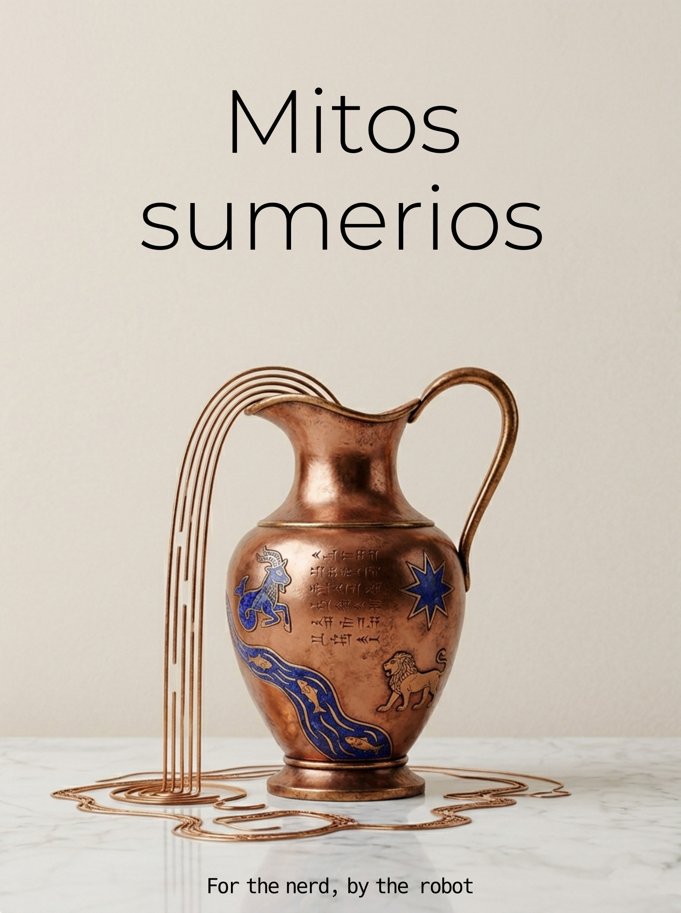

= Los mitos de Sumer: historias de los primeros escribas
Jose Blanca
:doctype: book
:toc: left
:sectnums:
:toc-title: Índice
:appendix-caption: Apéndice
:figure-caption: Figura
:table-caption: Tabla
:note-caption: Nota
:important-caption: Importante
:caution-caption: Precaución
:warning-caption: Advertencia
:lang: es
:front-cover-image: 
:bibtex-file: bibliography.bib
:bibtex-style: chicago-author-date

include::frontmatter.es.adoc[]

include::note-on-making.es.adoc[]

include::chapters/00-introduction.es.adoc[]

include::chapters/01-enki-and-ninhursaja.es.adoc[]

include::chapters/02-enki-and-ninmah.es.adoc[]

include::chapters/03-enki-and-the-world-order.es.adoc[]

include::chapters/04-enkis-journey-to-nibru.es.adoc[]

include::chapters/05-enlil-and-ninlil.es.adoc[]

include::chapters/06-enlil-and-sud.es.adoc[]

include::chapters/07-lugal-e.es.adoc[]

include::chapters/08-angim.es.adoc[]

include::chapters/09-ninurta-and-the-turtle.es.adoc[]

include::chapters/10-inanna-and-enki.es.adoc[]

include::chapters/11-inanna-and-ebih.es.adoc[]

include::chapters/12-inanna-and-shu-kale-tuda.es.adoc[]

include::chapters/13-inanna-and-gudam.es.adoc[]

include::chapters/14-inannas-descent.es.adoc[]

include::chapters/15-dumuzids-dream.es.adoc[]

include::chapters/16-inanna-and-bilulu.es.adoc[]

include::chapters/17-nannas-journey-to-nibru.es.adoc[]

include::chapters/18-marriage-of-martu.es.adoc[]

include::chapters/19-gilgamesh-and-aga.es.adoc[]

include::chapters/20-gilgamesh-and-the-bull-of-heaven.es.adoc[]

include::chapters/21-gilgamesh-and-huwawa.es.adoc[]

include::chapters/22-gilgamesh-enkidu-and-the-nether-world.es.adoc[]

include::chapters/23-death-of-gilgamesh.es.adoc[]

include::chapters/24-enmerkar-and-the-lord-of-aratta.es.adoc[]

include::chapters/25-enmerkar-and-en-suhgir-ana.es.adoc[]

include::chapters/26-lugalbanda-in-the-mountain-cave.es.adoc[]

include::chapters/27-lugalbanda-and-the-anzud-bird.es.adoc[]

include::chapters/28-eridu-flood-story.es.adoc[]

include::chapters/29-ningishzidas-journey.es.adoc[]

include::chapters/30-death-of-ur-namma.es.adoc[]

include::chapters/31-debate-hoe-and-plough.es.adoc[]

include::chapters/32-debate-ewe-and-grain.es.adoc[]

include::chapters/33-debate-winter-and-summer.es.adoc[]

include::chapters/34-debate-bird-and-fish.es.adoc[]

include::chapters/35-debate-copper-and-silver.es.adoc[]

include::chapters/36-debate-date-palm-and-tamarisk.es.adoc[]

include::comparative.es.adoc[]

include::character-appendix.es.adoc[]
